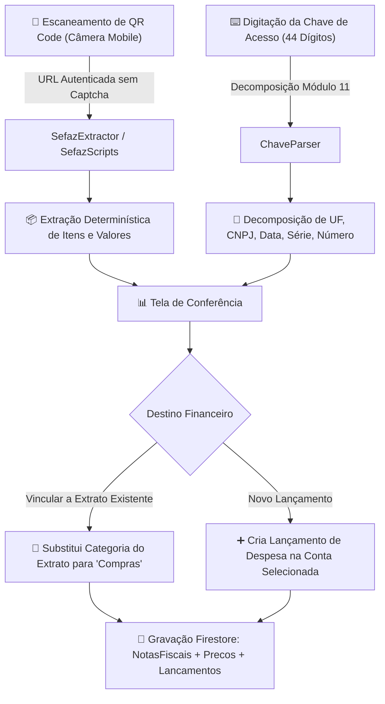

# 🧾 Manual de Importação de NF-e / NFC-e (Corta Gastos)

> **Documento Oficial de Engenharia, Regras de Negócio e Arquitetura do Módulo de Notas Fiscais**  
> *Versão de Integração: Corta Gastos V0.9.901+*

---

## 1. Visão Geral
O módulo de **Importação de NF-e / NFC-e** (`/Importacao/importar_nfe`) é o motor especializado na digitalização, extração e conciliação automática de cupons e notas fiscais brasileiras para o ecossistema do **Corta Gastos**.

### 🎯 Diretrizes Fundamentais do Sistema:
1. **Extração 100% Determinística (Sem IA na Leitura Fiscal):**
   - O processo de leitura dos dados fiscais não utiliza IA para ler ou inventar dados. Toda a extração de produtos, quantidades, unidades, valores unitários e totalizador é feita por **código e expressões regulares estruturadas (Regex)** sobre o DOM da SEFAZ.
2. **Diferença Técnica entre QR Code e Chave de Acesso:**
   - **QR Code da NFC-e (Consulta Direta sem CAPTCHA):** Conforme a legislação fiscal brasileira (Manual dos Padrões Técnicos do DANFE NFC-e e QR Code - ENCAT), a URL contida no QR Code é assinada e autenticada com tokens do emitente (`p=CHAVE|2|1|1|CSC|HASH`), **permitindo consulta direta ao consumidor sem exigência de CAPTCHA**.
   - **Chave de Acesso de 44 Dígitos (Consulta com CAPTCHA):** Ao consultar apenas os 44 números diretamente nos portais estaduais da SEFAZ, o governo impõe barreiras de segurança (reCAPTCHA / hCaptcha / Bloqueios anti-bot). Por isso, a digitação de chave manual decompõe os 44 dígitos em cabeçalho matemático (UF, CNPJ, Data, Série, Número), permitindo a conferência e o preenchimento do valor pago.
3. **Prevenção de Duplicidade de Gastos:**
   - A nota fiscal pode ser vinculada diretamente a uma transação do extrato bancário. Ao vincular, a categoria do extrato é substituída pela categoria de sistema `"Compras"`, garantindo que os itens da nota fiscal detalhem a despesa sem duplicar o valor financeiro.
4. **Base Histórica de Preços (`Precos`):**
   - Cada produto importado é registrado na coleção histórica de preços, permitindo ao usuário acompanhar a evolução de preços dos itens que consome ao longo do tempo.

---

## 2. Arquitetura do Fluxo de Importação

---

## 3. Estrutura dos Arquivos do Módulo

O módulo reside na pasta `/WEB/Importacao/importar_nfe/`:

| Arquivo | Responsabilidade |
| :--- | :--- |
| **`scanner_nfe.html`** | Interface visual com Layout Split (Sidebar com assistente Eduardo + Painel Central responsivo). |
| **`scanner_nfe.css`** | Estilização Dark Glassmorphism, viewport da câmera e animações de laser. |
| **`js/chave_parser.js`** | Validador matemático Módulo 11, formatação em blocos de 4 dígitos e decomposição dos 44 números da chave. |
| **`js/scanner.js`** | Controlador da câmera do dispositivo usando `html5-qrcode` com suporte a alternância de câmeras. |
| **`js/sefaz_scripts.js`** | Motor de parsing determinístico com regras de extração para SEFAZ RJ, SP, RS, MG e padrão genérico SVRS. |
| **`js/sefaz_extractor.js`** | Coordenador de extração web e ponte para WebView / InAppBrowser nativo no celular. |
| **`js/nfe_sync.js`** | Motor de persistência no Firestore: grava na coleção `NotasFiscais`, vincula com `Lancamentos` e alimenta a base `Precos`. |
| **`js/scanner_nfe.js`** | Controlador principal da página, gerenciamento de eventos, conferência e sincronização em tempo real. |

---

## 4. Decomposição da Chave de Acesso (44 Dígitos)

A chave de acesso segue a especificação nacional da Receita Federal:

$$\underbrace{\text{33}}_{\text{UF (RJ)}}\ \underbrace{\text{26 07}}_{\text{Ano/Mês}}\ \underbrace{\text{52 909 395 0001 43}}_{\text{CNPJ Emitente}}\ \underbrace{\text{65}}_{\text{Modelo NFC-e}}\ \underbrace{\text{001}}_{\text{Série}}\ \underbrace{\text{000 012 157}}_{\text{Nº da Nota}}\ \underbrace{\text{0}}_{\text{Emissão Normal}}\ \underbrace{\text{11478011}}_{\text{Cód. Aleatório}}\ \underbrace{\text{5}}_{\text{DV Módulo 11}}$$

- **UF (01-02):** Código IBGE do Estado emissor (ex: `33` = Rio de Janeiro, `35` = São Paulo).
- **AAMM (03-06):** Ano e mês de emissão.
- **CNPJ (07-20):** Cadastro da empresa emissora.
- **Modelo (21-22):** `65` para Cupom NFC-e ou `55` para NF-e.
- **Série (23-25) e Número (26-34):** Numeração sequencial da nota fiscal.
- **DV (44):** Dígito verificador gerado pelo algoritmo Módulo 11.

---

## 5. Regras de Negócio e Prevenção de Duplicidade

1. **Checagem de Duplicidade:**
   - Antes de qualquer processamento, a chave de 44 dígitos é consultada no Firestore. Se a nota já foi cadastrada, o sistema impede nova importação e avisa o usuário.
2. **Conciliação com Extrato Bancário:**
   - Se o usuário já importou o extrato do cartão de crédito ou conta bancária, o sistema localiza lançamentos de data e valor compatíveis.
   - Ao vincular, o lançamento bancário recebe a categoria de sistema `"Compras"` e o identificador `notaFiscalId`, unindo o débito financeiro aos itens detalhados da nota fiscal sem duplicar os gastos no Dashboard.
3. **Registro na Base Histórica de Preços:**
   - Cada item da nota fiscal alimenta a coleção `Precos` com `{ nomeProduto, valorUnitario, quantidade, unidade, data, cnpj, uf }`, permitindo consultas de histórico e comparação de preços no Corta Gastos.
