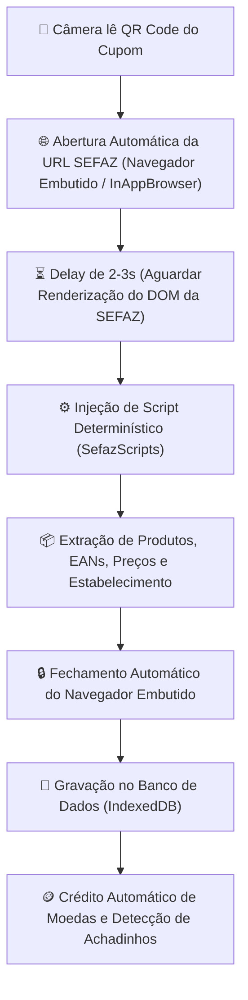

# 🧾 Manual de Importação de NF-e / NFC-e (Busca Ofertas)

> **Documento Oficial de Engenharia, Regras de Negócio e Arquitetura do Módulo de Notas Fiscais**  
> *Versão de Integração: Busca Ofertas V1.0*

---

## 1. Visão Geral e Diretrizes Inegociáveis

O módulo de **Importação de NF-e / NFC-e** é o motor automatizado de digitalização, extração determinística e alimentação da base de preços por **QR Code de Cupons Fiscais**.

### 🚫 Soluções Estritamente Proibidas (NÃO UTILIZAR):
1. ❌ **PROIBIDO: Cópia e Colagem Manual:** Não exigir que o usuário copie texto da SEFAZ e cole no app.
2. ❌ **PROIBIDO: Foto / OCR de Imagem com IA:** A leitura não deve depender de foto do papel nem de IA de visão.
3. ❌ **PROIBIDO: Digitação Manual de Valores/Itens:** O aplicativo deve extrair todos os produtos, quantidades, unidades, valores unitários e totalizador de forma 100% automatizada e determinística a partir da URL do QR Code.

---

## 🎯 Diretrizes Fundamentais de Funcionamento:

1. **Extração 100% Determinística e Automatizada:**
   - O processo de leitura é disparado unicamente pelo escaneamento do **QR Code da NFC-e**.
   - A consulta ocorre diretamente pela URL autenticada do QR Code (`p=CHAVE|2|1|1|CSC|HASH`), que é livre de CAPTCHA conforme as normas do ENCAT.

2. **Mecanismo de Abertura em Navegador Embutido (InAppBrowser / WebView):**
   - Ao ler o QR Code, o sistema aciona a abertura da URL da SEFAZ no navegador embutido (InAppBrowser / WebView).
   - **Delay Obrigatório de Renderização:** Aplica-se um delay configurado (2 a 3 segundos) para aguardar o carregamento completo do DOM da SEFAZ antes de injetar os scripts de extração.
   - O script injetado lê os elementos do DOM (`#tabResult`, `.table`, `innerText`), extrai todos os produtos com seus códigos/EANs e preços, e transmite os dados estruturados de volta para o aplicativo via `postMessage`.
   - A janela embutida é fechada automaticamente assim que a extração é concluída.

3. **Salvamento e Gamificação:**
   - Cada produto é salvo na tabela `produtos_precos` com EAN, descrição, valor unitário, supermercado e data.
   - O usuário recebe automaticamente suas moedas virtuais e bônus de "Achadinho" sem necessidade de ações adicionais.

---

## 2. Arquitetura do Fluxo de Importação Automatizado

